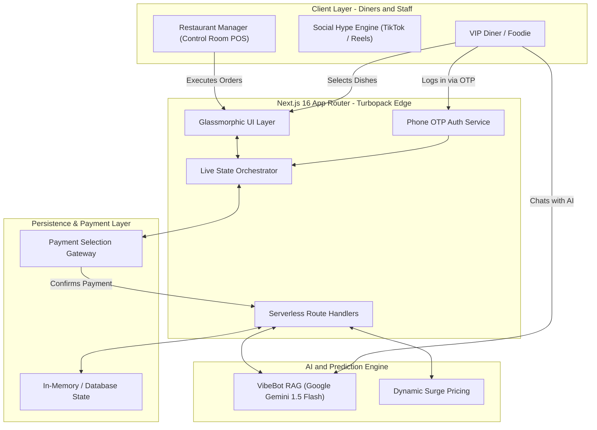
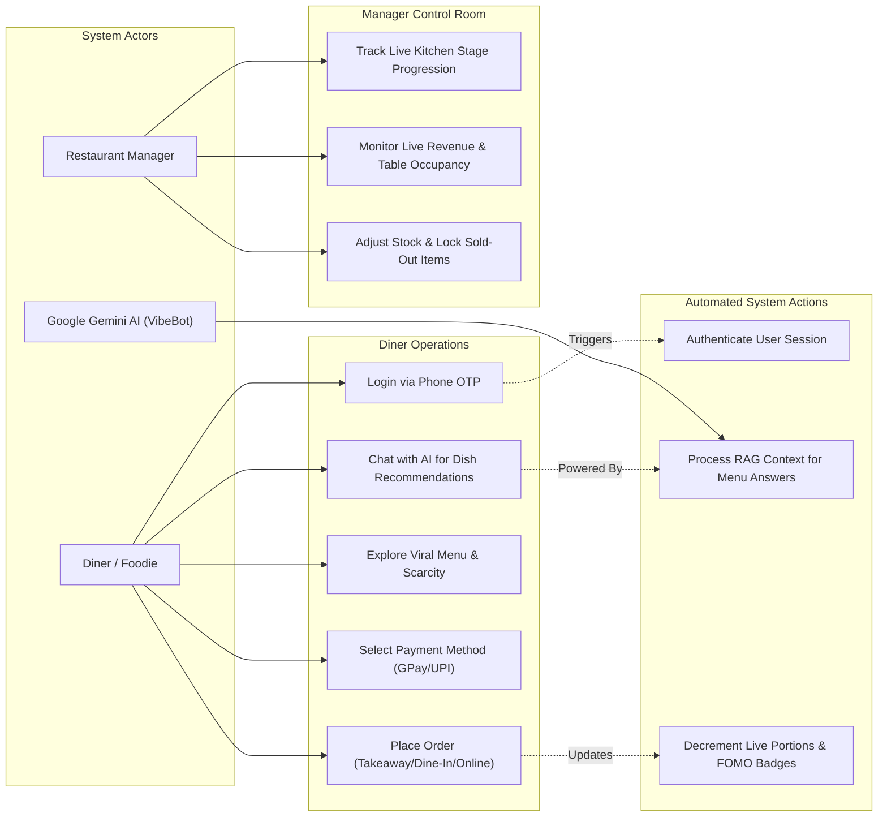

<div align="center">

# 🔥 VibeServe — The Viral Restaurant & Dining OS 👨‍🍳💨
### *"Something is Cooking... The #1 Trending AI Dining Operating System Built for Vibeathon 6.0"*

[](https://smart-restaurant-five.vercel.app)
[](https://aistudio.google.com/)
[](https://nextjs.org)
[](https://smart-restaurant-five.vercel.app)

<p align="center">
  <a href="https://smart-restaurant-five.vercel.app"><strong>🌐 Explore Live App (Vercel)</strong></a> •
  <a href="#-quick-start-in-30-seconds"><strong>🚀 Quick Start</strong></a> •
  <a href="#-why-something-is-cooking-"><strong>👨‍🍳 Why It's Viral</strong></a>
</p>

```
     🔥 SOMETHING IS COOKING IN THE KITCHEN... 👨‍🍳💨
 ┌────────────────────────────────────────────────────────┐
 │  ⚡ LIVE VIRAL PULSE: 1,420 TikTok Dishes Served Today │
 │  🤖 VIBEBOT AI: Gemini 1.5 Flash Chatbot Online       │
 │  🔒 SECURE AUTH: Real-Time Phone OTP Verified         │
 └────────────────────────────────────────────────────────┘
```

</div>

---

## 👨‍🍳 Why "Something is Cooking..."? (The Problem vs. The Viral Solution)

Traditional dining software (OpenTable, Toast, legacy POS systems) is **boring, clunky, and disconnected from modern foodie culture**. They treat dining like filling out a spreadsheet.

**VibeServe** changes everything. We built an **AI-powered, hyper-visual, social-first Dining Operating System** that bridges the gap between viral Instagram/TikTok food culture and high-efficiency kitchen orchestration.

| ❌ Legacy Restaurant Systems | 🔥 VibeServe Viral OS (Our Solution) |
| :--- | :--- |
| "What do you recommend?" guessing games | **🤖 VibeBot AI (Gemini 1.5)** trained on the entire menu context |
| Unsecured, anonymous web ordering | **📱 Phone OTP Authentication** for verified customer identity |
| Disjointed third-party payment links | **💳 Integrated Payment UI** supporting UPI, GPay, PhonePe, Cards |
| Static, boring paper or PDF menus | **Live Scarcity Engine** (`🔥 Only 3 portions left today!`) with real-time countdowns |

---

## ✨ Core Capabilities & Platinum Features

### 🤖 1. VibeBot AI (Powered by Google Gemini 1.5 Flash)
A fully integrated, floating RAG (Retrieval-Augmented Generation) chatbot. Trained on our entire restaurant menu, VibeBot understands ingredients, making-of stories, pricing, and viral scores. It can instantly recommend dishes based on user cravings in natural language.

### 📱 2. Phone OTP Authentication
Real-time phone number verification to secure the ordering pipeline. Users log in with their phone number, receive a 6-digit OTP, and gain access to place orders and save preferences. (Demo mode supports `123456`).

### 💳 3. Multi-Channel Payment Orchestration
A beautiful, glassmorphic payment selector intercepts the checkout flow, offering customers 1-click access to Indian payment methods like Google Pay, PhonePe, Paytm, and custom UPI IDs before firing the order to the kitchen.

### ⚡ 4. Real-Time Scarcity Engine (`portionsLeft` POS Sync)
Nothing drives conversion like authentic FOMO. VibeServe tracks real-time ingredient portions across the kitchen queue. When a dish drops below 5 portions, glowing pulse badges alert guests.

---

## 🗺️ System Architecture & Cloud Orchestration

VibeServe is built on a **Full-Stack Serverless Edge Architecture** utilizing Next.js 16 App Router (Turbopack) and Google Gemini AI, designed for high-concurrency viral traffic and real-time kitchen orchestration.



---

## 🎭 User Flow & Use Case Diagram

The following diagram illustrates how different system actors (**Diners**, **Managers**, and the automated **AI Pulse Engine**) interact across the VibeServe ecosystem:



---

## 🚀 Quick Start in 30 Seconds

Want to run **VibeServe** locally on your machine or deploy your own clone? It takes less than 30 seconds!

### 1. Clone the Viral Repo
```bash
git clone https://github.com/gagan-5757/smart-restaurant.git
cd smart-restaurant
```

### 2. Install Dependencies
```bash
npm install
```

### 3. Add Google Gemini API Key
Create a `.env.local` file in the root directory and add your key from Google AI Studio:
```env
GEMINI_API_KEY=AIzaSy...
```

### 4. Launch the Kitchen! 👨‍🍳🔥
```bash
npm run dev
```
Open [http://localhost:3000](http://localhost:3000) and experience the future of dining! (Use phone `9999999999` and OTP `123456` to demo Auth).

---

<div align="center">

**🔥 Built with passion by Team CodeCatalyst for Vibeathon 6.0 🔥**<br>
*If you love what is cooking here, give us a ⭐ on GitHub!*

</div>
