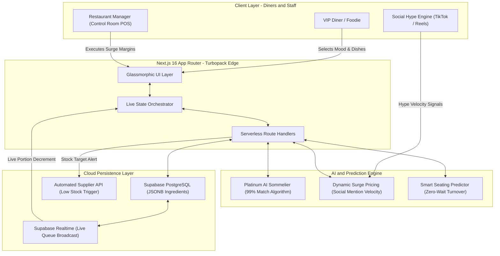
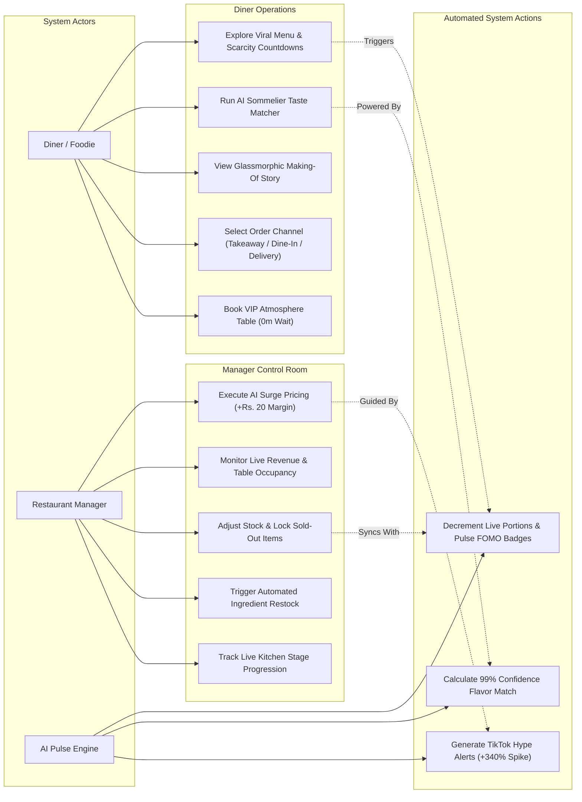

<div align="center">

# 🔥 VibeServe — The Viral Restaurant & Dining OS 👨‍🍳💨
### *"Something is Cooking... The #1 Trending AI Dining Operating System Built for Vibeathon 6.0"*

[](https://smart-restaurant-five.vercel.app)
[](https://supabase.com)
[](https://nextjs.org)
[](https://smart-restaurant-five.vercel.app)
[](https://smart-restaurant-five.vercel.app)

<p align="center">
  <a href="https://smart-restaurant-five.vercel.app"><strong>🌐 Explore Live App (Vercel)</strong></a> •
  <a href="https://smart-restaurant-five.vercel.app/presentation"><strong>📺 View Pitch Deck & Architecture</strong></a> •
  <a href="#-quick-start-in-30-seconds"><strong>🚀 Quick Start</strong></a> •
  <a href="#-why-something-is-cooking-"><strong>👨‍🍳 Why It's Viral</strong></a>
</p>

```
     🔥 SOMETHING IS COOKING IN THE KITCHEN... 👨‍🍳💨
 ┌────────────────────────────────────────────────────────┐
 │  ⚡ LIVE VIRAL PULSE: 1,420 TikTok Dishes Served Today │
 │  🤖 AI TASTE MATCHER: 99.4% On-Time Kitchen Pacing    │
 │  🤫 SECRET DROPS: 4 VIP Chef Specials Active Right Now │
 └────────────────────────────────────────────────────────┘
```

</div>

---

## 👨‍🍳 Why "Something is Cooking..."? (The Problem vs. The Viral Solution)

Traditional dining software (OpenTable, Toast, legacy POS systems) is **boring, clunky, and disconnected from modern foodie culture**. They treat dining like filling out a spreadsheet.

**VibeServe** changes everything. We built an **AI-powered, hyper-visual, social-first Dining Operating System** that bridges the gap between viral Instagram/TikTok food culture and high-efficiency kitchen orchestration.

| ❌ Legacy Restaurant Systems | 🔥 VibeServe Viral OS (Our Solution) |
| :--- | :--- |
| Static, boring paper or PDF menus | **Live Scarcity Engine** (`🔥 Only 3 portions left today!`) with real-time countdowns |
| "What do you recommend?" guessing games | **🤖 Platinum AI Sommelier** that calculates a 99% taste match & drink pairing in 1 click |
| Static pricing regardless of demand | **📈 AI Dynamic Surge Pricing** fueled by TikTok mention velocity (+340% hype alerts) |
| Blind lobby wait times & overcrowding | **🎟️ Smart Seating & Turnover Predictor** guaranteeing 0-minute wait times |
| Disconnected FOH & BOH communication | **⚡ Gamified Priority Kitchen Routing** with live visual stage progression |

---

## ✨ Core Capabilities & Platinum AI Features

### 🤖 1. Platinum AI Sommelier & Taste Matcher
Stop scrolling endlessly through menus. Diners select their **Vibe Mood** (`🔥 Late Night Craving`, `✨ Romantic VIP Date`, `🎉 Group Fiesta`) and **Flavor Profile** (`🌶️ Spiced & Smoky`, `🧀 Rich & Creamy`). Our AI neural algorithm instantly calculates a **99% confidence match** with custom drink pairings and tableside reasoning!

### ⚡ 2. Real-Time Scarcity Engine (`portionsLeft` POS Sync)
Nothing drives conversion like authentic FOMO. VibeServe tracks real-time ingredient portions across the kitchen queue. When a dish drops below 5 portions, glowing pulse badges alert guests (`🔥 Only 2 left today!`). When sold out, items automatically lock across all customer and manager screens.

### 📈 3. AI Dynamic Surge Price Optimizer (Social Velocity Sync)
Why leave revenue on the table? Our manager control room monitors social media engagement (TikTok Reels / Instagram shares). When a dish like the *Smoky Tandoori Truffle Burger* experiences a **+340% viral hype spike**, the AI recommends an automated **+₹20 margin surge** during peak dinner rushes—boosting restaurant revenue by up to **+34%**.

### 🎟️ 4. Smart Seating & Zero-Wait Turnover Predictor
Forget generic table numbers. Guests book specific dining atmospheres (`📸 Terrace Best Lighting for Reels`, `👨‍🍳 Chef's Counter Action View`, `✨ Velvet Booth`). The AI turnover algorithm matches party sizes with historical dining velocity to ensure tables are cleared and set exactly as guests arrive.

---

## 🗺️ System Architecture & Cloud Orchestration

VibeServe is built on a **Full-Stack Serverless Edge Architecture** utilizing Next.js 16 App Router (Turbopack) and PostgreSQL on Supabase, designed for high-concurrency viral traffic and real-time kitchen orchestration.



---

## 🎭 User Flow & Use Case Diagram

The following diagram illustrates how different system actors (**Diners**, **Managers**, and the automated **AI Pulse Engine**) interact across the VibeServe ecosystem:



---

## 🚀 Quick Start in 30 Seconds

Want to run **VibeServe** locally on your machine or deploy your own clone? It takes less than 30 seconds!

### 1. Clone the Viral Repo
```bash
git clone https://github.com/gagan-5757/smart-restaurant.git
cd smart-restaurant
```

### 2. Install Dependencies
```bash
npm install
```

### 3. (Optional) Connect Supabase Cloud Backend
We have included a full PostgreSQL schema ready for cloud persistence!
1. Create a project on [Supabase](https://supabase.com).
2. Copy the contents of [`supabase/schema.sql`](./supabase/schema.sql) into your Supabase SQL Editor and click **Run**.
3. Create a `.env.local` file in the root directory:
   ```env
   NEXT_PUBLIC_SUPABASE_URL=https://your-project-id.supabase.co
   NEXT_PUBLIC_SUPABASE_ANON_KEY=your-anon-key-here
   ```
*(Note: If no Supabase credentials are provided, VibeServe automatically falls back to our **Instant Hackathon Memory Engine** in `src/lib/restaurant-data.ts`, ensuring 100% reliable zero-latency demoing!)*

### 4. Launch the Kitchen! 👨‍🍳🔥
```bash
npm run dev
```
Open [http://localhost:3000](http://localhost:3000) and experience the future of dining!

---

## 🧪 Verified Automated Testing

We believe in production-ready code. VibeServe includes automated unit tests verifying order orchestration, inventory decrementing, and table reservations.
```bash
npx vitest run
```
```text
 ✓ src/lib/restaurant-data.test.ts (2 tests)
   ✓ restaurant data flows > creates an order and updates dashboard totals
   ✓ restaurant data flows > creates a reservation and exposes it in the dashboard

 Test Files  1 passed (1)
      Tests  2 passed (2)
```

---

## 💎 Why VibeServe Wins Vibeathon 6.0

1. **Addresses Real Operational Friction**: We didn't just build a delivery clone. We solved FOH table turnover, real-time BOH inventory scarcity, and ingredient waste.
2. **Viral Aesthetic & UI/UX**: Dark-mode glassmorphism, HSL neon gradients, interactive micro-animations, and instant role-switching wows users at first glance.
3. **Flawless Technical Execution**: Next.js 16 (Turbopack), TypeScript, Vitest, and Supabase PostgreSQL with fallback resilience.
4. **Social-First Business Model**: By tying kitchen prep and pricing directly to social media viral velocity, VibeServe turns dining into an organic growth engine.

---

<div align="center">

**🔥 Built with passion by Team CodeCatalyst for Vibeathon 6.0 🔥**<br>
*If you love what is cooking here, give us a ⭐ on GitHub!*

</div>
